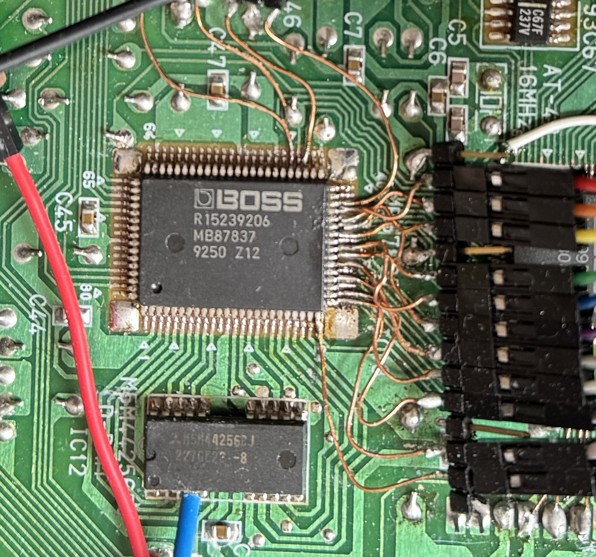

# lsp-emu

Emulation for the Boss MB87837 (LSP) chip, used in the SC-88Pro, SC-8850, ME-6, ME-6b, ME-X, and others.

## Chip Info

The LSP is a custom DSP which can execute 384 instructions programs for each sample. It can work with multiple sample rates (32k or 44.1k) and multiple bit depths. It supports two stereo outputs and one stereo input. It has a small internal ram for instructions, parameters and delay lines, but it also supports a bigger external one.

### Pinout

- 7, 33, 47, 73: +5v VDD
- 2, 12, 17, 23, 29, 39, 42, 52, 63, 69: VSS

- 40, 41: XTAL-EXTAL, clock crystal interface
  - Normally 2 * 384 * sample rate

- 75: SYI, sync interface (TODO)
- 74: SYO, sync interface (TODO)

- 34, 35, 36, 37, 38, 43, 44, 45: CD0-7, host interface data I/O
- 32, 31, 30, 28: CA0-3, host interface address in
- 24: RXW, host interface write control in
- 25: DS, host interface read control in
- 26: XCS, host interface chip select in
- 27: INT, host interface interrupt (TODO)

- 6, 5, 9, 8, 80: ED0-4, external RAM data I/O
- 22, 21, 20, 19, 18, 16, 15, 14, 13, 1: EA0-9, external RAM address out
- 10, 11: CAS0-1, external RAM column address strobe
- 3: RAS, external RAM row address strobe
- 4: WE, external RAM write enable

- 65: DABCLK, bit clock for audio out
- 68: DALRCLK, word clock for audio out
- 66, 67: TRS0-1, serial data lines for audio out

- 78: ADBCLK, bit clock for audio in
- 79: ADCC, word clock for audio in
- 77: TRR, serial data line for audio in
- 76: CK (TODO)

- 58, 59, 60, 61, 62, 64: G-XG2-XG1-A-B-C, address decoder control in
- 49, 50, 51, 53, 54, 55, 56, 57: Q0-7, address decoder out
- 46, 48: CPUCK1-2 (TODO)

- 70: X68 (TODO)
- 71: XE (TODO)
- 72: TEST (TODO)

### Host Interface

- **Read ready status**: read 0x03 until it reads 0x00
- **Write config register**: wait for ready status, write config in 0x03-0x02 then write 0x00 in 0x06
- **Write internal memory**: wait for ready status, write 3 bytes in 0x04(MSB)-0x03-0x02(LSB), then address in 0x01-0x00, writing in 0x00 triggers the write
- **Read internal memory**: write address in 0x09-0x08, wait for ready status, read 3 bytes from 0x02(MSB)-0x01-0x00(LSB)

### Config register

- 0x0001: start DSP
- 0x1001: halt DSP (18 bit? ME-6)
- 0x1021: halt DSP (16 bit? SC-88Pro)

### Internal Memory

- 0x000-0x07f: Internal delay line/registers
  - The internal registers are typically accessed as a circular buffer. Every time the current memory pointer is decremented by 1, and most(all?) instructions access memory access it using an offset
- 0x080-0x1ff: DSP program (24 bit x 384 instr)
  - Cannot(?) be written by the DSP program

## DSP instructions format

`ii rr cc`

ii[7] (0x80):  
ii[6] (0x40):  
ii[5] (0x20):  input = 0 or acc
ii[4] (0x10):  
ii[3] (0x08):  mem[offset] <- acc
ii[2] (0x04):  
ii[1] (0x02):  
ii[0] (0x01):  

rr[7]:         scale select
rr[6:0]:       mem offset/shifter

cc[7:0]:       coefficient (int8_t)

### Instr 00/08/20/28: MAC

> ab rr cc
a:       00: in_a=acc    20: in_a=0
b:       00: nothing     08: store to mem
rr[7]:   scale select
rr[6:0]: mem offset/shifter
cc:      coefficient (int8_t)

1. Store acc to mem if 0x08
2. Compute mac
3. Store result to acc

Examples:
  00 00 7f: acc += $00 * (0x7f/0x80)
  00 01 7f: acc += 0x7f << 0
  00 02 7f: acc += 0x7f << 5
  00 03 7f: acc += 0x7f << 10
  00 04 7f: acc += 0x7f << 15
  00 05 7f: acc += $05 * (0x7f/0x80)
  
  00 80 7f: acc += $00 * (0x7f/0x20)
  00 81 7f: acc += 0x7f << 2
  00 82 7f: acc += 0x7f << 7
  00 83 7f: acc += 0x7f << 12
  00 84 7f: acc += 0x7f << 17   (warning: saturated to 0x7fffff)
  00 85 7f: acc += $05 * (0x7f/0x20)

  00 00 90: acc += $00 * (signed(0x90)/0x80)
  00 01 90: acc += signed(0x90) << 0
  00 02 90: acc += signed(0x90) << 5
  00 03 90: acc += signed(0x90) << 10
  00 04 90: acc += signed(0x90) << 15
  00 05 90: acc += $05 * (signed(0x90)/0x80)

### Instr C0: ??

Examples:
  00 35 10: acc = acc + $35 * (0x10/0x80)
  c0 35 10: acc = $35 + $35 * (0x10/0x80)

  acc = 0x14
  c0 00 7f: ??
  c0 01 7f: acc += 0x7f << 0   (000093)
  c0 02 7f: acc += 0x7f << 5   (000ff4)
  c0 03 7f: acc += 0x7f << 10  (01fc14)
  c0 04 7f: acc += 0x7f << 15  (3f8014)
  c0 05 7f: ??

