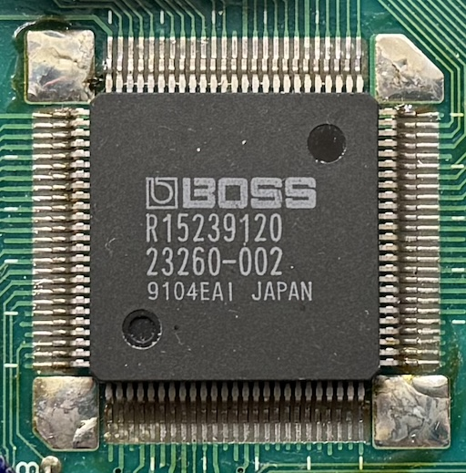
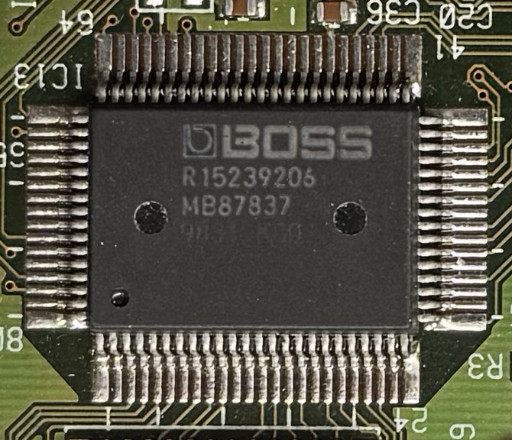
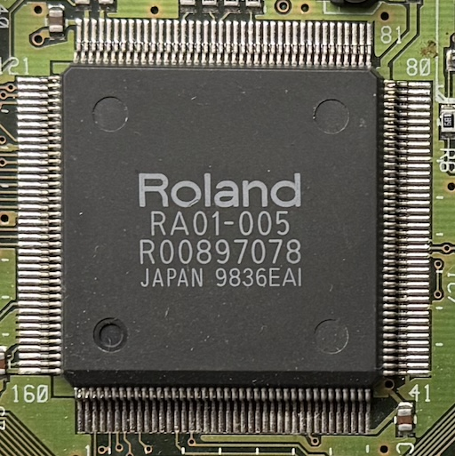
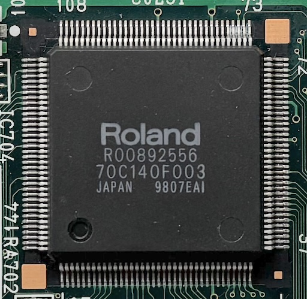

# roland-dsps

High-level info and emulation for Roland/Boss custom DSP chips.

## DSP (Toshiba TC23SC260AF-002, 1989)

Used in: RSP-550, JD-800, GP-16, SE-50, ME-10. 
Designer: Naoya Nozawa

[→ Go to info/emulator](./dsp)

## CSP (Toshiba TC6088AF, 1992)

Used in: SDE-330, SRV-330, SDX-330, JD-990, SE-70. 
Also revision CSP-2 exists (TC170C110AF-002, used in JV-2080, VG-8). 
Designer: Naoya Nozawa

[→ Go to info/emulator](./csp)

## LSP (Fujitsu MB87837, 1992)

Cut-down version of the CSP chip. 
Used in: SC-88Pro, SC-8850, ME-6, ME-6b, ME-X, others.

[→ Go to info/emulator](./lsp)

## XP (1994)

Integrated 64-voices sample player, TVF and DSP (JD-990 on-a-chip). 
Used in JV-1080, SC-88, many more. 
Many known versions manufactured by either Fujitsu or Toshiba.

[→ Go to info/emulator](./xp)

## ESP (Toshiba TC170C140AF-001, 1995)

Used in JP-8000, GP-1000, VS-880, GX-700, RSS-10, DR-880, many more. 
Also revisions ESP-2 (TC170C140AF-003) and ESP-4 (TC223C080AF-101) exist.

[→ Go to info/emulator](./esp)

## Others

- Hitachi HG61H20R36F (RRV-10, RV-2, MT-32, D-110, others)
  - [Already reverse engineered](https://github.com/sergm/munt_devel/blob/master/BossEmu/BossEmu.cpp)
- Hitachi HG62E22R64FS (RV-1000)
- Toshiba TC23SC140AF-00X (D-70, U-20, SRC-2, others)
  - DSP program in internal ROM (implant)
  - Different chip versions with ROM for reverb+chorus, sample rate conversion or piano resonance
- Toshiba TC25SC080AU-104 (HR-2, RV-3, RE-800, others)
  - Called MR-chip, likely budget version of the ESP chip (successor of the LSP)
  - Also MR-2 exists (TC203C040AF-001)
- Fujitsu MB87126-00X (D-50, DEP-5, DEP-3)
  - Uses internal ROM (dumpable optically)
  - Three revisions known, with different roms and bugfixes
- Fujitsu MB87427 (R-880, GS-6, E-660)
