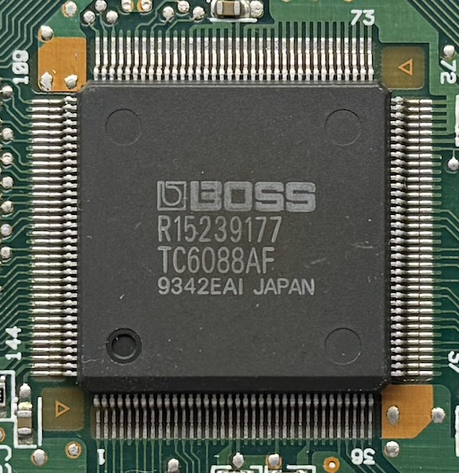
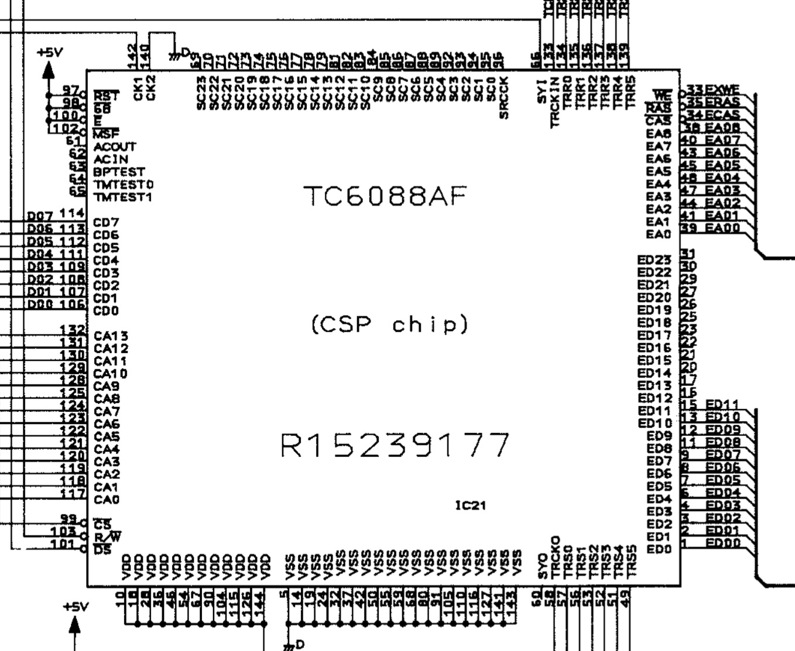
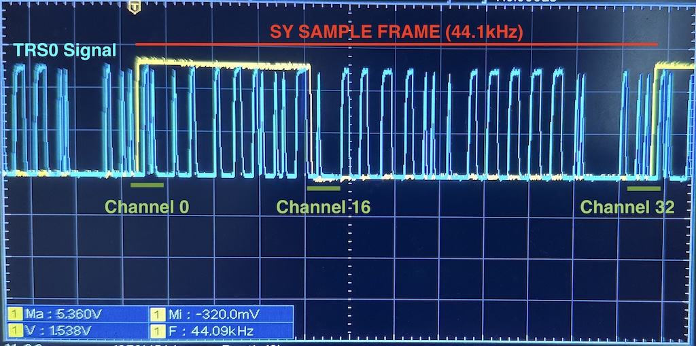

# CSP (Toshiba TC6088AF, 1992)



Used in: SDE-330, SRV-330, SDX-330, JD-990, SE-70.<br/>
Also revision CSP-2 exists (TC170C110AF-002, used in JV-2080, VG-8).<br/>
Designer: Naoya Nozawa


## Pinout



```
VDD: +5v

CD0-7: Host interface data bus
CA0-13: Host interface address bus
~CS: Host interface chip select
~DS: Host interface read enable
R/~W: Host interface write enable
~MSF: Host interface endianness (high: little endian, low: big endian, in groups of 4 bytes)

SYO: Sample rate sync out
SYI: Sample rate sync in
CK2,CK1: System clock xtal interface, usually sample rate x1536

TRCKO, TRS0-5: Output serial I/O
TRCKIN, TRR0-5: Input serial I/O
SRCCK, SC0-23: Parallel input (used for connecting to older synth chips)

ED0-23, EA0-8, ~CAS, ~RAS, ~WE: External DRAM interface

TMTEST0-1, BPTEST: Test pins (unknown)
ACIN, ACOUT: (unknown)
~RST, ~68, ~E: (unknown)
```


## Internal Memory

*NOTE: Assuming little endian interface mode*

- **PRAM** (program ram): 24-bit, 1024 words
  - Can be written from the host as 32-bit in the area 0x1000-0x1fff
  - Can be read from the host by writing 0x00 at the address 0x3000+i*4+2, result can be read at address 00,01,02
- **CRAM** (coefficient ram): 16-bit signed, 1024 words
  - Each coefficient is paired with a program instruction at the same word address
  - Can be written from the host as 16-bit in the area 0x0000-0x7ff
  - Can be read from the host by writing 0x00 at the address 0x2000+i*2+1, result can be read at address 00,01
- **IRAM** (internal ram): 24-bit, 512 words (?)
  - Cannot be written or read from the host interface
  - Addressed with offsets on a circular buffer, with the current pointer decrementing after each full program execution (each sample)
- **Accumulators**: two (accA, accB) 30-bit each
- **Special registers**
  - Internally used to control the DRAM interface, serial I/O and others
  - The only accessible one from the host is at 0x802 (?), which can be read in the same way as the CRAM (writing with offset +0x2000)
- **Configuration registers**: 24 bit
  - Accessible from the host at addresses 0x804, 0x808


### Configuration registers

- 804: ram config?
  - bit 0x400000: 12/24 bit bus mode
- 808: muting?


## External Memory (ERAM)

The CSP can optionally use up to 256kWord of external DRAM. It can be connected as single 24-bit read or two 12-bit reads (configurable with the bit 0x40 at 0x804).

The CSP automatically performs a CAS-before-RAS refresh each sample, and uses fast page mode to access the two consecutive half-words in case of 12-bit width setups. Internal logical addresses are left justified, so they are converted to physical by doing a >> 10 shift for 24 bit RAM busses and >> 9 for 12 bit configs.

The external DRAM is used as a circular buffer, with each sample decrementing the current pointer. The DSP program can perform the following DRAM operations:

1. Read ERAM @ circular buffer ptr + immediate offset
2. Write ERAM @ circular buffer ptr + immediate offset
3. Read ERAM @ absolute addr from register
4. Read ERAM @ circular buffer ptr + offset from register


## The TR bus

The TRS/TRR interface is serial/parallel: it can transmit up to 32 24-bit channels in full-duplex, 6 bits at a time. The pin TRx5 holds the MSB and the TRx0 the LSB.

The serial I/O can be used by the DSP program by writing/reading on internal special registers (0x190-0x1ef). Some devices use less channels (24), as the they are transmitted half (16) when the SY sync signal is up and half when the SY sync signal is down.



*NOTE: I fumbled in this picture, the start of the program is with SY low, so what I call channel 16 here is actually channel 0. This makes a lot more sense looking at the location of the relative special regs, with the first channel being 0x1C0. This also means that the sequence of channel is a very neat 0 to 24, as pulling SY to 0 again will force the program to reset to the start.*


## Instruction format

*NOTE: in case of mistakes, please refer to the emulator behavior, as it's likely more updated and tested against the real hardware.*

- b00-08: IRAM Offset / Immediate mode
  - 1: `mul = coef << 0`
  - 2: `mul = coef << 7`
  - else: `mul = mem[(pos+offs) & 0x1ff] * coef]`
- b09-0b: Store destination/special reg (pipeline stores value as it was 3 instructions before)
  - 0: no store
  - 1: store const -max_24, then loads -max_24 or immediate into acc
  - 2: use special reg (unsaturated)
  - 3: use special reg (saturated)
  - 4: store accA to IRAM (unsaturated)
  - 5: store accB to IRAM (unsaturated)
  - 6: store accA to IRAM (saturated)
  - 7: store accB to IRAM (saturated)
- b0c-0f: Opcode
  - 0: `accA += mul >> shift`
  - 1: `accB += mul >> shift`
  - 2: `accA  = mul >> shift`
  - 3: `accB  = mul >> shift`
  - 4: `accA  = (mul >= 0 ? mul : ~mul) >> shift`  (unused)
  - 5: `accA  = max(0, (muls >=0 ? muls : ~muls) + accA)   (weird pipeline)`
    - *NOTE: this opcode behaves weirdly, when saving to the IRAM its result, it requires +1 steps of pipeline, otherwise 0x0000 will be read*
  - 6: `accA  = ((mul >= 0 ? ~mul : mul) & 0x3fffffffff) >> shift`
  - 7: `accA += ((mul >= 0 ? ~mul : mul) & 0x3fffffffff) >> shift`
  - 8: `accA  = (mul >= 0 ? mul : ~mul) >> shift`
  - 9: `accA += (mul >= 0 ? mul : ~mul) >> shift`
  - a: `accA += mul >> 15 >> shift`
  - b: `accB += mul >> 15 >> shift`
  - c: `accA  =` multiplication (see below)
  - d: `accB  =` multiplication (see below)
  - e: `accA +=` multiplication (see below)
  - f: `accB +=` multiplication (see below)
- b10-11: Multiplier shift select
  - 0: `>> 15`
  - 1: `>> 14`
  - 2: `>> 13`
  - 3: `>> 11`
- b12: Unknown (unused in the SDE/SRV-330, probably related to SC parallel bus or clocking)
- b13: ERAM start operation
- b14-17: ERAM control/offset


### Opcode 50

+00: 00 50 05
+01
+02
+03 store to mem:
      accA = max(0, ((abs(mem) * abs(coef)) >> shift) + accA)
      accB = accB >= 0 ? 0 : accB
+04 store to mem:
      accA = max(0, ((abs(mem) * abs(coef)) >> shift) + accA)
...
+08 store to mem: (normal)
      accA = ((abs(mem) * abs(coef)) >> shift) + accA

Storing accA/accB in the range between 04 and 08 stores 0 regardless of the actual value, if the initial opcode 50 clamps to 0.


### Multiplication opcodes (c/d/e/f)

Depending on the coefficient, these opcodes compute their result differently:

- Coef 0000: (none?)
- Coef 0001: `(mem * 0x7ff0) >> shift` (? controlled by muting bit)
- Coef 0002: `mem + ~((~mem * (~(s186 & 0xffffff) >> 8))) >> shift`
- Coef 0003: `mem + ~((~mem * (~(s186 & 0xffffff) >> 8))) >> shift`
- Coef 0004: `(mem * (~s186 >> 8)) >> shift`
- Coef 0005: `(mem * (~s187 >> 8)) >> shift`
- Coef 0006: `(mem * (s186 >> 8)) >> shift`
- Coef 0007: `(mem * (s187 >> 8)) >> shift`

If an immediate-like memory offset is used (01/02), the value 0x8000 is used, shifted accordingly.

*TODO:* for modes 02/03 there is some weird rounding going on that causes that formula to be slightly wrong in some cases (at most by 3).


### Examples

The following code load the immediate value 0x1234, increments it using a value from ram, and then writes it to the circular buffer with an offset of 0x15 (saturated):

```
00 20 01  1234   // accA  = 0x1234 << 0
00 00 16  4000   // accA += (mem[pos + 0x16] * 0x4000) >> 15
00 00 00  0000
00 00 00  0000
00 0c 15  0000   // store accA -> mem[pos + 0x15]
```


### ERAM Access

The highest part of the instructions (b13-17) is used to control the access to the external RAM. The ERAM commands are sequenced: it's possible to form a complex ram command over multiple instructions, where the order and position matters.

It's possible to start a memory operation with the following values (regarding b13-17):
- 08,18,28,38: Read  @ circular buffer ptr + immediate offset
- 48,58,68,78: Write @ circular buffer ptr + immediate offsett
- 88,98,a8,b8: Read  @ absolute address (from special reg 185/18d)
- c8,d8,e8,f8: Read  @ circular buffer ptr + offset (from special reg 185/18d)

*NOTE: It's possible to interleave start commands. After a read, another can be started already at position +7. Switching between read and write seems to require +9 instead.*

After a start command is issued, the highest nibble (b14-17) of the following 5 instructions can be used to form an immediate offset:
- pos +0: start command
- pos +1: adjust << 0
- pos +2: adjust << 4
- pos +3: adjust << 8
- pos +4: adjust << 12
- pos +5: adjust << 16
- ...
- pos +7 last valid slot for writing full write latch
- pos +8
- pos +9
  - last valid slot for writing high write latch (high 12 bits are written here)
  - first slot valid for reading low 12 bits (low 12 bits are readt here)
- pos +a
- pos +b first slot valid for reading full 12 bits

The result of adding together the 5 nibbles is then summed (unsigned) to the internal circular buffer counter (which decrements automatically after each sample) and ANDed with 0x3ffff (18 bit of addresses).

The read modes 88-f8 can use a special register (185/18d) as read pointer or offset. The 24 bit register is shifted by >> 10. When using those addressing modes, it's only possible to sum +1 to the address with the immediate nibbles. Using any bigger value will cause an error. This is especially useful to get a sample and the immediately next one, to perform linear interpolation. When using 

After a write command is issued, the value to write to the ERAM needs to be put into the special register 183/18b at most at pos +5.

After a read command is issued, it's possible to read the result using the special registers 1f0-1ff.

*TODO: why are there 16 read registers? Is it like a circular buffer? Is 1f0 reserved for the indirect addressing? NOTE: the LSP also stores the value in ERAM at that address.*


### Special Registers

Using instructions with a store value of 2 or 3 (0x04/0x06), special registers can be accessed.
- Some special registers are write or read only: writing a read-only registers will do nothing, while reading a write-only register will read 0.
- Some write-only registers will get their value from accA, while others from accB.
- Some special registers can perform branching: if their condition is verified, the program execution jumps to the address specified by the coefficient value.

#### Branching registers

| Addr     | R/W         | Function                   |
|----------|-------------|----------------------------|
|   0x172  |   JMP       |   Jump (always)            |
|   0x173  |   JMP accA  |   Jump (accA > 0)          |
|   0x174  |   JMP accA  |   Jump (accA sat overflow) |
|   0x175  |   JMP accA  |   Jump (accA < 0)          |
|   0x176  |   JMP accA  |   Jump (accA == 0)         |
|   0x177  |   JMP accA  |   Jump (accA >= 0)         |


#### General registers

| Addr     | R/W       | Function                        |
|----------|-----------|---------------------------------|
|   0x180  |   W accA  | Unknown (unused)                |
|   0x181  |   W accA  | Unknown (unused)                |
|   0x182  |   W accA  | Write host interface (0x802)    |
|   0x183  |   W accA  | ERAM write latch                |
|   0x184  |   W accA  | Unknown (unused)                |
|   0x185  |   W accA  | ERAM second tap pos             |
|   0x186  |   W accA  | Multiplication coeff (06)       |
|   0x187  |   W accA  | Multiplication coeff (07)       |
|   0x188  |   W accB  | Unknown (unused)                |
|   0x189  |   W accB  | Unknown (unused)                |
|   0x18A  |   W accB  | Write host interface (0x802)    |
|   0x18B  |   W accB  | ERAM write latch                |
|   0x18C  |   W accB  | Unknown (unused)                |
|   0x18D  |   W accB  | ERAM second tap pos             |
|   0x18E  |   W accB  | Mul coef (06)                   |
|   0x18F  |   W accB  | Mul coef (07)                   |


**NOTE**: writing to 185/18d will also load the multiplication coeff 07 and 06 in the following way:
- 06 = (val & 0x3ff) << 13
- 07 = val


#### Serial I/O registers

| Addr     | R/W       | Function                   |
|----------|-----------|----------------------------|
|   0x190  |   R       |   TRR SY1 slot0            |
|   0x191  |   R       |   TRR SY1 slot1            |
|   0x192  |   R       |   TRR SY1 slot2 (SE70 L)   |
|   0x193  |   R       |   TRR SY1 slot3 (SDE L)    |
|   0x194  |   R       |   TRR SY1 slot4            |
|   0x195  |   R       |   TRR SY1 slot5            |
|   0x196  |   R       |   TRR SY1 slot6            |
|   0x197  |   R       |   TRR SY1 slot7            |
|   0x198  |   R       |   TRR SY1 slot8            |
|   0x199  |   R       |   TRR SY1 slot9            |
|   0x19A  |   R       |   TRR SY1 slot10           |
|   0x19B  |   R       |   TRR SY1 slot11           |
|   0x19C  |   R       |   TRR SY1 slot12           |
|   0x19D  |   R       |   TRR SY1 slot13           |
|   0x19E  |   R       |   TRR SY1 slot14           |
|   0x19F  |   R       |   TRR SY1 slot15           |
|          |           |                            |
|   0x1A0  |   R       |   TRR SY0 slot0            |
|   0x1A1  |   R       |   TRR SY0 slot1            |
|   0x1A2  |   R       |   TRR SY0 slot2 (SE70 R)   |
|   0x1A3  |   R       |   TRR SY0 slot3            |
|   0x1A4  |   R       |   TRR SY0 slot4            |
|   0x1A5  |   R       |   TRR SY0 slot5            |
|   0x1A6  |   R       |   TRR SY0 slot6            |
|   0x1A7  |   R       |   TRR SY0 slot7 (SDE R)    |
|   0x1A8  |   R       |   TRR SY0 slot8            |
|   0x1A9  |   R       |   TRR SY0 slot9            |
|   0x1AA  |   R       |   TRR SY0 slot10           |
|   0x1AB  |   R       |   TRR SY0 slot11           |
|   0x1AC  |   R       |   TRR SY0 slot12           |
|   0x1AD  |   R       |   TRR SY0 slot13           |
|   0x1AE  |   R       |   TRR SY0 slot14           |
|   0x1AF  |   R       |   TRR SY0 slot15           |
|          |           |                            |
|   0x1B0  |   W accA  |   TRS SY1 slot0 (SDE L)    |
|   0x1B1  |   W accA  |   TRS SY1 slot1            |
|   0x1B2  |   W accA  |   TRS SY1 slot2            |
|   0x1B3  |   W accA  |   TRS SY1 slot3            |
|   0x1B4  |   W accA  |   TRS SY1 slot4            |
|   0x1B5  |   W accA  |   TRS SY1 slot5            |
|   0x1B6  |   W accA  |   TRS SY1 slot6            |
|   0x1B7  |   W accA  |   TRS SY1 slot7            |
|   0x1B8  |   W accA  |   TRS SY1 slot8            |
|   0x1B9  |   W accA  |   TRS SY1 slot9            |
|   0x1BA  |   W accA  |   TRS SY1 slot10           |
|   0x1BB  |   W accA  |   TRS SY1 slot11 (SE70 R)  |
|   0x1BC  |   W accA  |   TRS SY1 slot12           |
|   0x1BD  |   W accA  |   TRS SY1 slot13           |
|   0x1BE  |   W accA  |   TRS SY1 slot14           |
|   0x1BF  |   W accA  |   TRS SY1 slot15           |
|          |           |                            |
|   0x1C0  |   W accA  |   TRS SY0 slot0            |
|   0x1C1  |   W accA  |   TRS SY0 slot1            |
|   0x1C2  |   W accA  |   TRS SY0 slot2            |
|   0x1C3  |   W accA  |   TRS SY0 slot3            |
|   0x1C4  |   W accA  |   TRS SY0 slot4 (SDE R)    |
|   0x1C5  |   W accA  |   TRS SY0 slot5            |
|   0x1C6  |   W accA  |   TRS SY0 slot6            |
|   0x1C7  |   W accA  |   TRS SY0 slot7            |
|   0x1C8  |   W accA  |   TRS SY0 slot8            |
|   0x1C9  |   W accA  |   TRS SY0 slot9            |
|   0x1CA  |   W accA  |   TRS SY0 slot10           |
|   0x1CB  |   W accA  |   TRS SY0 slot11 (SE70 L)  |
|   0x1CC  |   W accA  |   TRS SY0 slot12           |
|   0x1CD  |   W accA  |   TRS SY0 slot13           |
|   0x1CE  |   W accA  |   TRS SY0 slot14           |
|   0x1CF  |   W accA  |   TRS SY0 slot15           |
|          |           |                            |
|   0x1D0  |   W accB  |   TRS SY1 slot0 (SDE L)    |
|   0x1D1  |   W accB  |   TRS SY1 slot1            |
|   0x1D2  |   W accB  |   TRS SY1 slot2            |
|   0x1D3  |   W accB  |   TRS SY1 slot3            |
|   0x1D4  |   W accB  |   TRS SY1 slot4            |
|   0x1D5  |   W accB  |   TRS SY1 slot5            |
|   0x1D6  |   W accB  |   TRS SY1 slot6            |
|   0x1D7  |   W accB  |   TRS SY1 slot7            |
|   0x1D8  |   W accB  |   TRS SY1 slot8            |
|   0x1D9  |   W accB  |   TRS SY1 slot9            |
|   0x1DA  |   W accB  |   TRS SY1 slot10           |
|   0x1DB  |   W accB  |   TRS SY1 slot11 (SE70 R)  |
|   0x1DC  |   W accB  |   TRS SY1 slot12           |
|   0x1DD  |   W accB  |   TRS SY1 slot13           |
|   0x1DE  |   W accB  |   TRS SY1 slot14           |
|   0x1DF  |   W accB  |   TRS SY1 slot15           |
|          |           |                            |
|   0x1E0  |   W accB  |   TRS SY0 slot0            |
|   0x1E1  |   W accB  |   TRS SY0 slot1            |
|   0x1E2  |   W accB  |   TRS SY0 slot2            |
|   0x1E3  |   W accB  |   TRS SY0 slot3            |
|   0x1E4  |   W accB  |   TRS SY0 slot4 (SDE R)    |
|   0x1E5  |   W accB  |   TRS SY0 slot5            |
|   0x1E6  |   W accB  |   TRS SY0 slot6            |
|   0x1E7  |   W accB  |   TRS SY0 slot7            |
|   0x1E8  |   W accB  |   TRS SY0 slot8            |
|   0x1E9  |   W accB  |   TRS SY0 slot9            |
|   0x1EA  |   W accB  |   TRS SY0 slot10           |
|   0x1EB  |   W accB  |   TRS SY0 slot11 (SE70 L)  |
|   0x1EC  |   W accB  |   TRS SY0 slot12           |
|   0x1ED  |   W accB  |   TRS SY0 slot13           |
|   0x1EE  |   W accB  |   TRS SY0 slot14           |
|   0x1EF  |   W accB  |   TRS SY0 slot15           |

#### ERAM read registers

| Addr     | R/W  | Function         |
|----------|------|------------------|
|   0x1F0  |   R  |   ERAM tap read  |
|   0x1F1  |   R  |   ERAM tap read  |
|   0x1F2  |   R  |   ERAM tap read  |
|   0x1F3  |   R  |   ERAM tap read  |
|   0x1F4  |   R  |   ERAM tap read  |
|   0x1F5  |   R  |   ERAM tap read  |
|   0x1F6  |   R  |   ERAM tap read  |
|   0x1F7  |   R  |   ERAM tap read  |
|   0x1F8  |   R  |   ERAM tap read  |
|   0x1F9  |   R  |   ERAM tap read  |
|   0x1FA  |   R  |   ERAM tap read  |
|   0x1FB  |   R  |   ERAM tap read  |
|   0x1FC  |   R  |   ERAM tap read  |
|   0x1FD  |   R  |   ERAM tap read  |
|   0x1FE  |   R  |   ERAM tap read  |
|   0x1FF  |   R  |   ERAM tap read  |

**NOTE:** writing to those registers will also write the returned value to the IRAM as well (at position +0x1fx).
