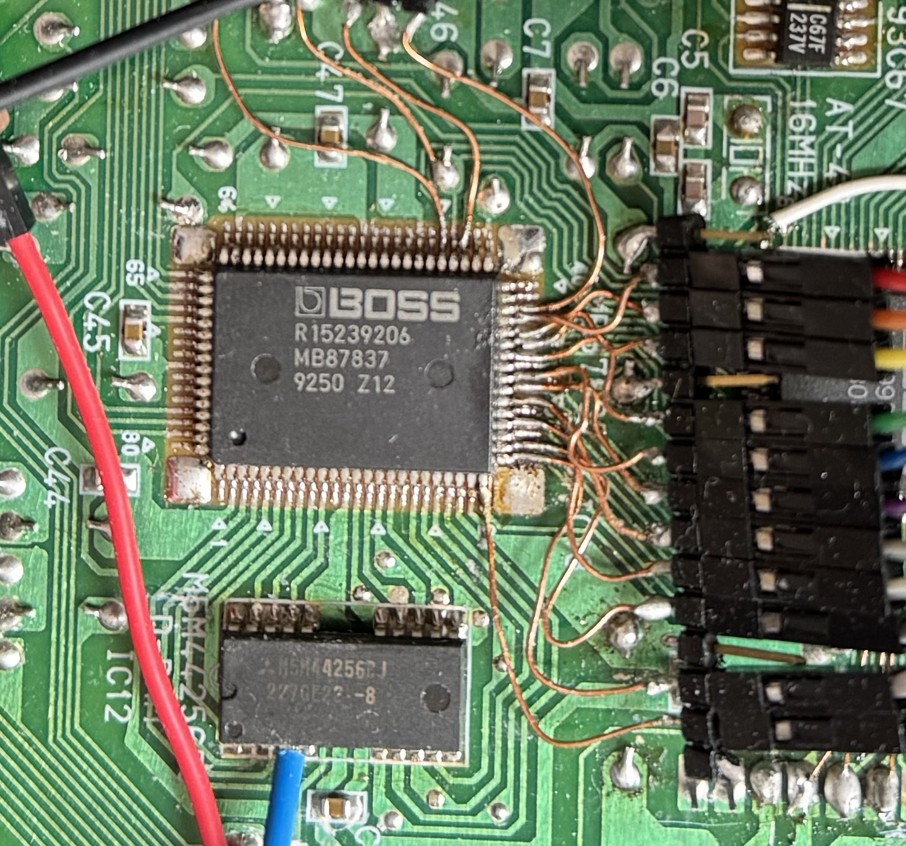
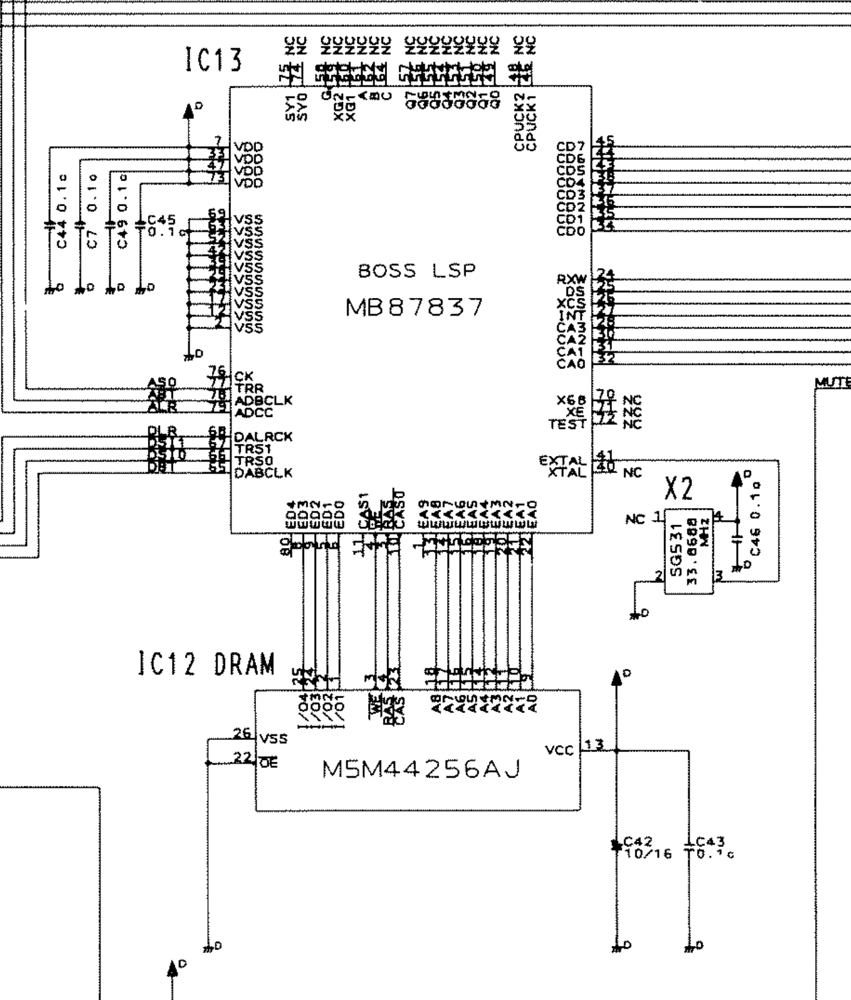

# lsp-emu

Emulation for the Boss MB87837 (LSP) chip, used in the SC-88Pro, SC-8850, ME-6, ME-6b, ME-X, and others.

## Effect emulation status

- [x] Thru
- [x] Stereo-EQ
- [x] Spectrum
- [x] Enhancer
- [x] Humanizer
- [x] Overdrive
- [x] Distortion
- [x] Phaser
- [x] Auto Wah
- [x] Rotary
- [x] Stereo Flanger
- [x] Step Flanger
- [x] Tremolo
- [x] Auto Pan
- [x] Compressor
- [x] Limiter
- [x] Hexa Chorus
- [x] Tremolo Chorus
- [x] Stereo Chorus
- [x] Space D
- [x] 3D Chorus
- [x] Stereo Delay
- [x] Mod Delay
- [x] 3 Tap Delay
- [x] 4 Tap Delay
- [x] Tm Ctrl Delay
- [x] Reverb
- [x] Gate Reverb
- [x] 3D Delay
- [x] 2 Pitch Shifter
- [x] Fb Pitch Shifter
- [x] 3D Auto
- [x] 3D Manual
- [x] Lo-Fi 1
- [x] Lo-Fi 2

## Chip Info

The LSP is a custom DSP which can execute 384 instructions programs for each sample. It can work with multiple sample rates (32k or 44.1k) and multiple bit depths. It supports two stereo outputs and one stereo input. It has a small internal ram for instructions, parameters and delay lines, but it also supports a bigger external one, used for more complex effects.



### Pinout



```
7, 33, 47, 73: +5v VDD
2, 12, 17, 23, 29, 39, 42, 52, 63, 69: VSS

40, 41: XTAL-EXTAL, clock crystal interface, freq = 2 * 384 * sample rate

75: SYI, sync interface (TODO)
74: SYO, sync interface (TODO)

34, 35, 36, 37, 38, 43, 44, 45: CD0-7, host interface data I/O
32, 31, 30, 28: CA0-3, host interface address in
24: RXW, host interface write control in
25: DS, host interface read control in
26: XCS, host interface chip select in
27: INT, host interface interrupt (TODO)

6, 5, 9, 8, 80: ED0-4, external RAM data I/O
22, 21, 20, 19, 18, 16, 15, 14, 13, 1: EA0-9, external RAM address out
10, 11: CAS0-1, external RAM column address strobe
3: RAS, external RAM row address strobe
4: WE, external RAM write enable

65: DABCLK, bit clock for audio out
68: DALRCLK, word clock for audio out
66, 67: TRS0-1, serial data lines for audio out

78: ADBCLK, bit clock for audio in
79: ADCC, word clock for audio in
77: TRR, serial data line for audio in
76: CK (TODO)

58, 59, 60, 61, 62, 64: G-XG2-XG1-A-B-C, address decoder control in
49, 50, 51, 53, 54, 55, 56, 57: Q0-7, address decoder out
46, 48: CPUCK1-2 (TODO)

70: X68 (TODO)
71: XE (TODO)
72: TEST (TODO)
```

### Host Interface

- **Read ready status**: read address 0x03 until it reads 0x00
- **Write config register**: wait for ready status, write config in 0x03-0x02 then write 0x00 or 0xff in 0x06
- **Write internal memory**: wait for ready status, write 3 bytes in 0x04(MSB)-0x03-0x02(LSB), then address in 0x01-0x00, writing in 0x00 triggers the write
- **Read internal memory**: write address in 0x09-0x08, wait for ready status, read 3 bytes from 0x02(MSB)-0x01-0x00(LSB)

### Config register

- 0x0001: start DSP
- 0x1001: halt DSP (18 bit? ME-6)
- 0x1021: halt DSP (16 bit? SC-88Pro)

### Internal Memory

All internal variables are 24 bit. (TODO confirm)

#### Memory Map (accessible from host)

- 0x000-0x07f: Internal delay line/registers
  - The internal registers are typically accessed as a circular buffer. Every sample the current memory pointer is decremented by 1, and most instructions access memory access it using an offset
- 0x080-0x1ff: DSP program (24 bit x 384 instr)
  - Cannot(?) be written by the DSP program

#### Hidden Variables

There are two 24-bit accumulator registers (accA and accB).

Some instructions also access some special internal variables:
```
00   (unused)   accA?
01   (unused)   accA?
02   (unused)   accA?
03   (unused)   accA?
04   (unused)   accA?
05   (unused)   accA?
06   (unused)   accA?
07   (unused)   accA?
08   (unused)   accA?
09   (unused)   accA?
0a   (unused)   accA?
0b   (unused)   accA?
0c   accA?
0d   accA 3 slots before?
0e   constant 0?  some enable (if set to 0 stuff breaks and dram stops writing)
0f   constant 0?  some enable (if set to 0 stuff breaks and dram stops writing)
10   ERAM write latch, accA? (shift=15)  NOTE: breaks if you put a nop before
11   accA? (shift=7)
12   (unused)   constant 0?  some enable (if set to 0 stuff breaks and dram stops writing)
13   ERAM tap offset (>>10 ?)
14   multiplier value for 0x80 A
15   multiplier value for 0x80 B
16   accA?
17   (unused)   accA?
18   audio out (cannot be read)
19   (unused)   accA?
1a   $7a  ERAM read value A (<< 4)
1b   $7b  ERAM read value B (<< 4)
1c   $7c  ERAM read value C (<< 4)
1d   $7d  ERAM read value D (<< 4)
1e   $7e  audio in  (max 0xffffc0)
1f   (unused)   $7f  audio in
```


### External Memory

Seems to be 16bits wide (4 bit x 4 reads in fast page mode, LSB first, >> 9).
DRAM address does -1 every sample.


#### ERAM addresses

16 bit data is stored in 4 slots, using doing +0/+1/+2/+3 on the Col addr

Every sample:
Row: 0x0ff->0x000  and 0x1ff->0x100 (high bit stays)
every wrap from Row 0x0ff-0x000 Col does -4 (go to next 4 slots)
every wrap from Col 0x000-0x1fc Row inverts msb

row   col
1ff   1fc-1fd-1fe-1ff
1fe   1fc-1fd-1fe-1ff
...
100   1fc-1fd-1fe-1ff
1ff   1f8-1f9-1fa-1fb
1fe   1f8-1f9-1fa-1fb
...
100   100-101-102-103
0ff   1fc-1fd-1fe-1ff
...
000   100-101-102-103
1ff   0fc-0fd-0fe-0ff

def row_col_to_linear(row, col):
  col_msb = col >> 8
  row_msb = row >> 8
  col_low = (col & 0xff) >> 2
  row_low = row & 0xff
  return (col_msb<<15) | (row_msb<<14) | (col_low<<8) | row_low


#### ERAM sequences

Each ram command takes at least 6 slots, during which other commands can be issues which affect the current transaction.
The write content (s50) can be set on the the +8 slot after the write command (06)?
The read content (s7a...) can be read on the the +12 slot after the read command?
The tap 04 offset (s53) is always populated with d8 (unsigned accA).


- 06(0)->06(9)->04(e) -> writes to ptr, then to ptr+0x7fc0?
- 02(0)->04(5)->02(6) -> reads ptr, ptr+0x7fc0? 0x8040?
- after a 02, the next 02 read can happen 6 slots later

pos   incr(01)    incr(02)    incr(03)      incr(04)      incr(05)      incr(06)      incr(07)
00    ?           ?           ?             ?
01    +0x01       +0x02       +0x03         +0x4
02    +0x08       +0x10       +0x18         +0x20         +0x728?       +0x730?       +0x738?
03    +0x40       +0x80       +0x7c0?
04    +0x1000     +0x2000     +0x3000
05    +0x20000    +0xff00(s)  +0x28100(s)


pos    incr (01)   incr (03)   incr (07)    shift
00     
01     1           3                        0
02     8                                    3
03     40                                   6
04     200                                  9
05     1000        3000        7000         12
06     8000                                 15
-> putting commands on +06 can only sum 0x8000 if command&1, but if it's not 01 it will also start a new transaction

-> special case: starting with 05 does weird stuff


-> different with 04?
pos    incr (01)   incr (02)
00     
01     ??          1
02     ??          0
03     
04     
05     
06     


06-00-00-00-00-06     does 1 write only
06-00-00-00-00-00-06  does 2 writes
06-00-00-00-00-00-01  does 1 write only, sum(toggle) 0x100 to col addr
adding more spaces then does nothing


## DSP instructions format

Each DSP instruction is 3 bytes long, using a format like `ii rr cc`.

- `ii` encodes an opcode
- `rr` encodes a shift value and a memory offset
- `cc` encodes a signed 8 bit offset (except for opcode 0x80)

```
ii[7:5] (0xe0):  opcode

  with mem offset == 1/2/3/4
  where shift(cc) = cc << (r[6:0] - 1)
    0x00: accA = accA + shift(cc)
    0x20: accA = shift(cc)
    0x40: accB = accB + shift(cc)
    0x60: accB = shift(cc)
    0x80: ?? (TODO, likely similar to the other version)
    0xa0: accA = abs(shift(cc))
    0xc0: accA = accA + shift(cc)
    0xe0: accB = accB + shift(cc)

  with mem offset != 1/2/3/4
    0x00: accA = accA + ((mem[offset] * cc) >> 7)
    0x20: accA = (mem[offset] * cc) >> 7
    0x40: accB = accB + ((mem[offset] * cc) >> 7)
    0x60: accB = (mem[offset] * cc) >> 7
    0x80: accA = accA + mem[offset] * special_reg (see below)
    0xa0: accA = abs((mem[offset] * cc) >> 7)
  
  with mem offset & 0x60
    0xc0: accA  = special_reg[offset & 0x1f]
    0xe0: accB  = special_reg[offset & 0x1f]
  with mem offset & 0x40
    0xc0: accA += special_reg[offset & 0x1f]
    0xe0: accB += special_reg[offset & 0x1f]

  c8 post action (needs 2 empty slots before)
    0xc8: accA += accA * cc
    0xd0: accA += accB * cc
    0xd8: accA += accA * cc (unsigned?)
    0xc8: accB += accA * cc
    0xd0: accB += accB * cc
    0xd8: accB += accA * cc

ii[4:3] (0x18):  store mem (executed before computation)

  with opcode == 0xc0/0xe0 && offset < 0x40
    0x00: no store
    0x08: mem[offset | 0x20] = accA with saturation
    0x10: mem[offset | 0x20] = accB with saturation
    0x18: mem[offset | 0x20] = accA without saturation
  
  with opcode == 0xc0/0xe0 && offset >= 0x40
    0x00: no store
    0x08: special_reg[offset & 0x1f] = accA with saturation
    0x10: special_reg[offset & 0x1f] = accB with saturation
    0x18: special_reg[offset & 0x1f] = accA without saturation
  
  else
    0x00: no store
    0x08: mem[offset] = accA with saturation
    0x10: mem[offset] = accB with saturation
    0x18: mem[offset] = accA without saturation (there seems to be a separate sign bit for accA so that it can overflow after 0xffffff keeping the same saturated value)

ii[2:0] (0x07):  external ram opcode? (TODO)
    shift = special $13 >> 10
    written value is in special $10
    read result is in special $1a/$1b/$1c/$1d
  00  (none)
  01  apply shift to addr (while in frame depending on the position)
  02  read ptr
  03  read ptr (?)
  04  read ptr+shift
  05  read ptr+some other shift?
  06  write ptr
  07  write ptr (and apply shift 0x100?)

rr[7]:         scale select (<<2 after multiplier)
rr[6:0]:       mem offset/immediate shifter

cc[7:0]:       immediate/coefficient (int8_t) (except for 0x80)
```

### Pipeline

The chip is pipelined, so the order/location of instructions is important. Programs have NOPs (`00 00 00`) to flush the pipeline pretty regularly. Some programs also use the order instructions to perform side effects (for example reassigning a variable and reading the old value immediately after).

- The write instructions (like `08 00 00`) will use the accumulator value skipping two slots before
- An increment immediate instruction (like `00 01 01`) can be placed immediately after a load, MAC or load results seems to be applied immediately
- Written memory can be accessed immediately after writing
- External ram needs NOPs (TODO)
- Instructions with special registers (`c0 rr xx`) have special needs
  - `c0 40 xx` will read the accumulator 3 instructions before (like `08`)
  - `c0 50 xx` and `c0 d0 xx` will read the accumulator that is set in the instruction immediately before (adding another instruction in between breaks it)
  - `c0 50 xx` will execute using the accumulator value after the following instruction has completed


### Instr 00/20/40/60: MAC

Increments (opcode 00/40) or replaces (opcode 20/60) the accumulator A (opcode 00/20) or B (opcode 40/60).
The shifter values of 1/2/3/4 work as immediates, every other works as a memory reference offset. Increment works with 24 bit saturation and multiplies using fractional integer multiplication. The scale of the multiplication can be set with rr[7].
Can also store the current value to the ram before computing the new one (opcode x8).

Examples:
```
00 00 7f: acc += $00 * (0x7f/0x80)
00 01 7f: acc += 0x7f << 0
00 02 7f: acc += 0x7f << 5
00 03 7f: acc += 0x7f << 10
00 04 7f: acc += 0x7f << 15
00 05 7f: acc += $05 * (0x7f/0x80)

00 80 7f: acc += $00 * (0x7f/0x20)
00 81 7f: acc += 0x7f << 2
00 82 7f: acc += 0x7f << 7
00 83 7f: acc += 0x7f << 12
00 84 7f: acc += 0x7f << 17   (warning: saturated to 0x7fffff)
00 85 7f: acc += $05 * (0x7f/0x20)

00 00 90: acc += $00 * (signed(0x90)/0x80)
00 01 90: acc += signed(0x90) << 0
00 02 90: acc += signed(0x90) << 5
00 03 90: acc += signed(0x90) << 10
00 04 90: acc += signed(0x90) << 15
00 05 90: acc += $05 * (signed(0x90)/0x80)

20 00 7f: acc = $00 * (0x7f/0x80)
20 01 7f: acc = 0x7f << 0
20 02 7f: acc = 0x7f << 5
20 03 7f: acc = 0x7f << 10
20 04 7f: acc = 0x7f << 15
20 05 7f: acc = $05 * (0x7f/0x80)
```


### Instr c0/e0: Special regs access

```
  - c0 00 7f: acc = $00 * (0x7f/0x80)
  - c0 01 7f: acc += 0x7f << 0
  - c0 02 7f: acc += 0x7f << 5
  - c0 03 7f: acc += 0x7f << 10
  - c0 04 7f: acc += 0x7f << 15
  - c0 05 7f: acc = $05 * (0x7f/0x80)

C0 special cases:
  - c0 40 7f: acc = acc + acc * (0x7f/0x80)
  - c0 50 ff: acc = acc + (((acc >> 6) * 0xff) >> 7)  NO
  - c0 50 ff: acc = acc + 0xff >> 3  ??
  - c0 d0 ff: acc = acc + 0xff >> 1  ??
  - c0 7f 7f: acc = audioIn * (0x7f/0x80)

  Tested? mirror of c8
  - c0 15 40: accA += ($35 * 0x40) >> 7
  - c0 35 40: accA  = ($35 * 0x40) >> 7 (no sum?)
  - c0 5a 40: accA += (0xfffc00(constant?) * 0x40) >> 7
  - c0 7e 40: accA += (audioIn * 0x40) >> 7

  - c0 50 20: acc += (acc * 0x20) >> 15
  - c0 d0 20: acc += (acc * 0x20) >> 13
  - c0 51 20: acc += (acc * 0x20) >> 7
  - c0 d1 20: acc += (acc * 0x20) >> 5


Ranges
  00-1f -> 20-3f,    sum accumulator
  20-3f -> 20-3f,    replace accumulator
  40-5f -> special?, sum accumulator
  60-7f -> special?, replace accumulator
Specials
  40 60 c0 e0   accA?
  41 61 c1 e1   accA?
  42 62 c2 e2   accA?
  43 63 c3 e3   accA?
  44 64 c4 e4   accA?
  45 65 c5 e5   accA?
  46 66 c6 e6   accA?
  47 67 c7 e7   accA?
  48 68 c8 e8   accA?
  49 69 c9 e9   accA?
  4a 6a ca ea   accA?
  4b 6b cb eb   accA?
  4c 6c cc ec   accA?
  4d 6d cd ed   accA? (used as 6d)
  4e 6e ce ee   constant 0? (used as 6e)
  4f 6f cf ef   constant 0? (used as 6f)
  50 70 d0 f0   accA? (shift=15)  NOTE: breaks if you put a nop before
  51 71 d1 f1   accA? (shift=7)
  52 72 d2 f2   constant 0?  -> setting it to 0 messes up the accumulator? next multiplier?
  53 73 d3 f3   accA?  (eram?)
  54 74 d4 f4   multiplier value for 0x80 A
  55 75 d5 f5   multiplier value for 0x80 B
  56 76 d6 f6   accA?  (unused)
  57 77 d7 f7   accA?  (unused)
  58 78 d8 f8   audio out (cannot be read)
  59 79 d9 f9   accA?  (unused)
  5a 7a da fa   $7a  constant 0xfffc00? (eram tap?)
  5b 7b db fb   $7b  constant 0xfffc00? (eram tap?)
  5c 7c dc fc   $7c  constant 0xfffc00? (eram tap?)
  5d 7d dd fd   $7d  constant 0xfffc00? (eram tap?)
  5e 7e de fe   $7e  audio in
  5f 7f df ff   $7f  audio in (unused?)


C8 special cases:
  - `c8 00 00`: stores accA into $20
  - `c8 01 00`: stores accA into $21
  - `c8 02 00`: stores accA into $22
  - `c8 0f 00`: stores accA into $2f
  - `c8 15 00`: stores accA into $35
  - `c8 1f 00`: stores accA into $3f
  - `c8 20 00`: stores accA into $20 (wrap?)
  - `c8 30 00`: stores accA into $30 (wrap?)
  - `c8 3f 00`: stores accA into $3f (wrap?)
  - `c8 40 00`: stores nothing (??)
  - ...
  - `c8 58 00`: stores accA into $78 (audio out)
  - `c8 59 00`: stores nothing (??)
  - `c8 5a 00`: stores 0xfffc00 into $7a (constant?)
  - `c8 5b 00`: stores 0xfffc00 into $7b (constant?)
  - `c8 5c 00`: stores 0xfffc00 into $7c (constant?)
  - `c8 5d 00`: stores 0xfffc00 into $7d (constant?)
  - `c8 5e 00`: stores audio in into $7e
  - `c8 5f 00`: stores audio in into $7f
  - `c8 60 00`: stores nothing (??)
  - `c8 6f 00`: stores nothing (??)
  - ...
  - `c8 7a 00`: stores 0xfffc00 into $7a (constant?)
  - `c8 7b 00`: stores 0xfffc00 into $7b (constant?)
  - `c8 7c 00`: stores 0xfffc00 into $7c (constant?)
  - `c8 7d 00`: stores 0xfffc00 into $7d (constant?)
  - `c8 7e 00`: stores audio in into $7e
  - `c8 7f 00`: stores audio in into $7f


20 02 10, c0 50 30  (0x200)  ->  000206
20 02 10, c0 50 40  (0x200)  ->  000208
20 02 10, c0 50 50  (0x200)  ->  00020a
20 02 10, c0 50 70  (0x200)  ->  00020e
20 02 10, c0 50 90  (0x200)  ->  000212
20 02 10, c0 50 a0  (0x200)  ->  000214
20 02 10, c0 50 f0  (0x200)  ->  00021e

20 02 10, c0 d0 30  (0x200)  ->  000218
20 02 10, c0 d0 40  (0x200)  ->  000220
20 02 10, c0 d0 50  (0x200)  ->  000228
20 02 10, c0 d0 70  (0x200)  ->  000238
20 02 10, c0 d0 90  (0x200)  ->  000248
20 02 10, c0 d0 a0  (0x200)  ->  000250
20 02 10, c0 d0 f0  (0x200)  ->  000278

20 02 50, c0 d0 30  (0xa00)  ->  000a18
20 02 50, c0 d0 40  (0xa00)  ->  000a20
20 02 50, c0 d0 50  (0xa00)  ->  000a28
20 02 50, c0 d0 70  (0xa00)  ->  000a38
20 02 50, c0 d0 90  (0xa00)  ->  000a48
20 02 50, c0 d0 a0  (0xa00)  ->  000a50
20 02 50, c0 d0 f0  (0xa00)  ->  000a78

20 02 70, c0 d0 30  (0xe00)  ->  000e18
20 02 70, c0 d0 40  (0xe00)  ->  000e20
20 02 70, c0 d0 50  (0xe00)  ->  000e28
20 02 70, c0 d0 70  (0xe00)  ->  000e38
20 02 70, c0 d0 90  (0xe00)  ->  000e48
20 02 70, c0 d0 a0  (0xe00)  ->  000e50
20 02 70, c0 d0 f0  (0xe00)  ->  000e78
```


### Instr 80: multiplication per variable

```
s54=0x315ea0
val=0x640


```


```
s54=0x300000
val=0x000fe0

00 -> 000000
01 -> 0005f4
02 -> 0005f4
03 -> 0005f4
04 -> ffff81
05 -> fffa0c
06 -> fffa0c
07 -> 0000fe
08 -> 0005f4
09 -> 0005f4
0a -> 0005f4
0b -> fffe83
0c -> fffa0c
0d -> fffa0c
0e -> fffa0c
0f -> fffa0c
10 -> 000000
11 -> 000000
12 -> 000000
13 -> 000000
14 -> 000000
15 -> 000000
16 -> 000000
17 -> 000000
18 -> 000000
19 -> 000000
1a -> 000000
1b -> 000000
1c -> 000000
1d -> 000000
1e -> 000000
1f -> 000000
20 -> 0003f8
21 -> 0005f4
22 -> 0005f4
23 -> 0005f4
24 -> fffb89


Coefs
    00  acc += 00
    01  acc += ($mem * (special $54 >> 16)) >> 7
    02  acc += ($mem * (special $55 >> 16)) >> 7
 u  03  acc += ($mem * (special $55 >> 16)) >> 7

 u  04  acc += (($mem * 0x40) >> 7) * -1
    05  acc += ($mem * (special $54 >> 16)) >> 7 * -1
 u  06  acc += ($mem * (special $55 >> 16)) >> 7 * -1
 u  07  acc += ($mem * (special $55 >> 16)) >> 7 * -1

 u  08  acc  = ($mem * 0x08) >> 7
    09  acc  = ($mem * (special $54 >> 16)) >> 7
    0a  acc  = ($mem * (special $55 >> 16)) >> 7
 u  0b  acc  = ($mem * (special $55 >> 16)) >> 7

 u  0c  acc  = (($mem * 0xc0) >> 7) * -1
    0d  acc  = ($mem * (special $54 >> 16)) >> 7 * -1
    0e  acc  = ($mem * (special $55 >> 16)) >> 7 * -1
 u  0f  acc  = ($mem * (special $55 >> 16)) >> 7 * -1

 u  10  acc += 00
    11  acc += 00  (??)
    12  
    13  
    14  
    15
    16
    17
    18
    19
    1a
    1b
    1c
    1d
    1e
    1f
    41  acc += (0x4 ??) only works if after single digit
    42
    45
    46
    51
    52
    55

Bits (not a pattern after 0x10?)
  cc[0] 0x1   ?
  cc[1] 0x2   mul in $54 or $55
  cc[2] 0x4   invert sign
  cc[3] 0x8   accumulate/replace
  cc[4] 0x10  
  cc[5] 0x20  
  cc[6] 0x40  
  cc[7] 0x80  

Combos
  01-01
  09-01
  09-02
  09-05  (with c8 da 20 in between)
  09-41  ??
  01-41  acc += (mem*(coef>>16))>>7 + (mem*(coef>>16))>>14
  02-42
  05-45
  1a-52
  ...


With immediate (acc=0x42)
  00: 000042
  01: 000042
  02: 000041
  03: 000041

  04: 00003e
  05: 000042
  06: 000043
  07: 000043

  08: 000008
  09: 000000
  0a: ffffff
  0b: ffffff

  0c: fffff4
  0d: 000000
  0e: 000001
  0f: 000001


accA = 0x000012
accB = 0x000013
$15  = 0x000100
  80 15 00 -> 000012 000013
  80 15 01 -> 000012 000013
  80 15 02 -> 000010 000013
  80 15 03 -> 000010 000013
  80 15 04 -> 00000a 000013
  80 15 05 -> 000012 000013
  80 15 06 -> 000014 000013
  80 15 07 -> 000014 000013  accA+=2
  80 15 08 -> 000010 000013
  80 15 09 -> 000000 000013
  80 15 0a -> fffffe 000013
  80 15 0b -> fffffe 000013
  80 15 0c -> ffffe8 000013
  80 15 0d -> 000000 000013
  80 15 0e -> 000002 000013
  80 15 0f -> 000002 000013
  80 15 10 -> 000012 000033  ??
  80 15 11 -> 000012 000013
  80 15 12 -> 000012 000011  ??
  80 15 13 -> 000012 000011  ??
  80 15 14 -> 000012 ffffeb  ??
  80 15 15 -> 000012 000013
  80 15 16 -> 000012 000015  ??
  80 15 17 -> 000012 000015  ??
  80 15 18 -> 000012 000030  ??


======================================================


accA = 0x00
$25  = 0x42

  80 25 00: 000000
  80 25 01: 000000
  80 25 02: ffffff
  80 25 03: ffffff
  80 25 04: fffffe
  80 25 05: 000000
  80 25 06: 000001
  80 25 07: 000001
  80 25 08: 000004
  80 25 09: 000000
  80 25 0a: ffffff
  80 25 0b: ffffff
  80 25 0c: fffffa
  80 25 0d: 000000
  80 25 0e: 000001
  80 25 0f: 000001
  80 25 10: 000000
  80 25 11: 000000
  80 25 12: 000000
  80 25 13: 000000
  80 25 14: 


80 25 04:  accA = accA - (mem >> 5)
  mem:0x080000, accA:0x3f8000 -> 0x3f4000
  mem:0x100000, accA:0x3f8000 -> 0x3f0000
  mem:0x180000, accA:0x3f8000 -> 0x3ec000
  mem:0x200000, accA:0x3f8000 -> 0x3e8000
  
  mem:0x004000, accA:0x01fc00 -> 0x01fa00
  mem:0x008000, accA:0x01fc00 -> 0x01f800
  mem:0x00c000, accA:0x01fc00 -> 0x01f600
  mem:0x010000, accA:0x01fc00 -> 0x01f400

80 25 05:  ?? do nothing
  mem:0x080000, accA:0x3f8000 -> 0x3f8000
  mem:0x100000, accA:0x3f8000 -> 0x3f8000
  mem:0x180000, accA:0x3f8000 -> 0x3f8000
  mem:0x200000, accA:0x3f8000 -> 0x3f8000

  mem:0x000200, accA:0x000fe0 -> 0x000fe0

80 25 06:  accA = accA + (mem >> 7)
  mem:0x080000, accA:0x3f8000 -> 0x3f9000
  mem:0x100000, accA:0x3f8000 -> 0x3fa000
  mem:0x180000, accA:0x3f8000 -> 0x3fb000
  mem:0x200000, accA:0x3f8000 -> 0x3fc000


80 25 09:  ?? do nothing
  mem:0x080000, accA:0x3f8000 -> 0x000000
  mem:0x100000, accA:0x3f8000 -> 0x000000
  mem:0x3f8000, accA:0x3f8000 -> 0x000000
```


### Audio I/O

`c0 7f 7f` -> input audio into acc
addr 7e/7f work the same?
ff works the same but changes multiplier scale

input is dependent on pgm pos
- `>2   -> in channel 2`
- `>191 -> in channel 1`


`c8 58 00` -> output acc into audio out
dependent on pgm pos
- `>2   -> out channel 2` (TODO check)
- `>191 -> out channel 1` (TODO check)
